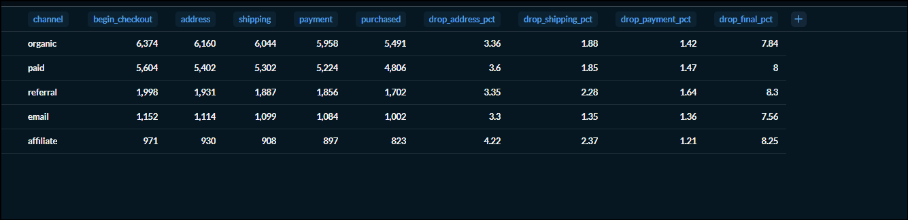
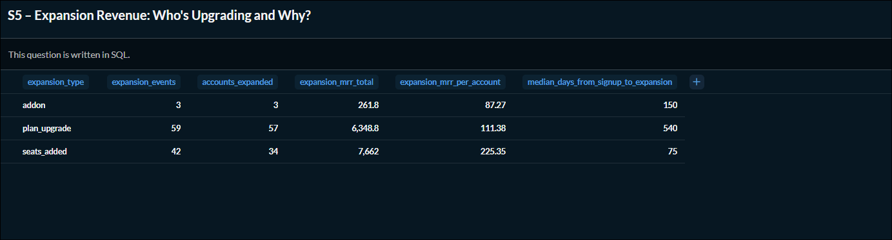

# Product Analytics Portfolio

End-to-end SQL Product Analytics portfolio analyzing both **B2C Ecommerce** and **B2B SaaS** datasets.

This project answers 10 real product analytics business questions covering activation, funnels, retention, recurring revenue, payment recovery, and expansion. Each query includes business interpretation, PM recommendations, and sanity checks to validate the results.

## Portfolio Links

📊 **Metabase Collection:** https://metabase.topfolio.in/collection/104-task-2

📝 **Notion Case Study:** https://acidic-green-d92.notion.site/B2C-vs-B2B-How-Funnels-and-Retention-Actually-Differ-3ae6d0d6f119803c961fdb36f3f0b214

## Key Findings

- Trial-to-paid conversion is strongest during the first two weeks after signup.
- Seat additions generated the highest expansion MRR, while plan upgrades were the most frequent expansion event.
- Several SaaS cohorts have Gross Revenue Retention below 80%, highlighting opportunities to improve customer retention.
- Ecommerce checkout drop-off is concentrated between product views and add-to-cart.

---
## Query Index

| Query | Business Question | Primary Stakeholder |
|-------|-------------------|---------------------|
| E1 | Customer Activation Curve | Product |
| E2 | Checkout Funnel Drop-off | Product |
| E3 | Weekly Cohort Retention | Growth |
| E4 | High-View, Low-Cart Products | Product |
| E5 | Cart Abandonment by Value Bucket | Marketing |
| S1 | Monthly MRR Movement Decomposition | Finance |
| S2 | Trial-to-Paid Conversion by Cohort | Product |
| S3 | GRR & NRR by Cohort | Finance |
| S4 | Dunning Funnel | Finance |
| S5 | Expansion Revenue | Product |

## Repository Structure

```
queries/
├── e1_activation_curve.sql
├── e2_checkout_funnel_dropoff.sql
├── e3_cohort_retention_weekly.sql
├── e4_pdp_high_view_low_cart.sql
├── e5_cart_abandonment_by_value_bucket.sql
├── s1_mrr_movement_decomposition.sql
├── s2_trial_to_paid_conversion.sql
├── s3_grr_nrr_by_cohort.sql
├── s4_dunning_funnel.sql
└── s5_expansion_revenue.sql

notes/
└── saas_schema.md
```

## Dashboard Preview

### B2C Ecommerce Funnel



### SaaS Revenue Retention


### Expansion Revenue



## Schema Documentation

The repository includes detailed schema documentation covering:

- Table inventory
- Column dictionary
- Verified relationships
- ER diagram
- Data quality findings
- Six schema probe questions

See: `notes/saas_schema.md`

## B2C vs B2B Product Analytics

Although both projects use similar SQL techniques such as CTEs, window functions, cohort analysis, and aggregations, the underlying analytical questions differ because of the business model. The table below summarizes the key differences observed across the two domains.

| Aspect            | B2C Ecommerce                | SaaS (Self-Serve & B2B)           |
| ----------------- | ---------------------------- | --------------------------------- |
| Primary Entity    | User / Session               | Account                           |
| Funnel            | Browse → Checkout → Purchase | Signup → Trial → Paid → Expansion |
| Funnel Duration   | Minutes                      | Days to Months                    |
| Conversion Metric | Checkout Conversion          | Trial-to-Paid Conversion          |
| Retention Metric  | Customer Return Rate         | GRR & NRR                         |
| Revenue Growth    | New Purchases                | Renewals + Expansion              |
| PM Focus          | Reduce Checkout Friction     | Improve Conversion & Expansion    |
| Time Horizon      | Short-term                   | Long-term Customer Value          |

## Key Takeaway

Although both projects used similar SQL techniques such as CTEs, window functions, and cohort analysis, the underlying business questions were very different. Ecommerce focused on optimizing user behaviour within short customer journeys, while SaaS emphasized long-term account growth through retention and expansion. Comparing these datasets showed me that understanding the business context is just as important as writing correct SQL.
